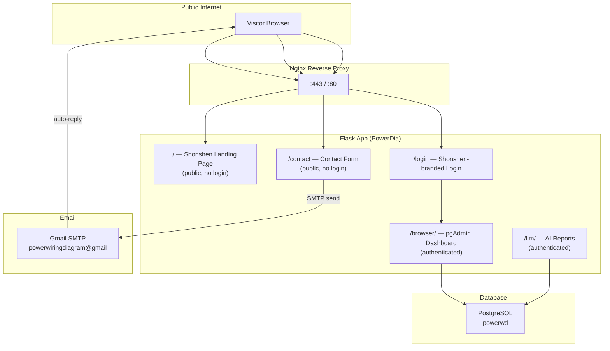

# Shonshen — Public Website for PowerDia

Transform the existing PowerDia platform into a public-facing website called **Shonshen** that lets visitors explore the application, interact with AI-powered reports, and contact you via Gmail.

## User Review Required

> [!IMPORTANT]
> **Gmail App Password Required**: Google no longer allows "Less Secure Apps". You must enable **2-Step Verification** on `powerwiringdiagram@gmail.com` and generate an **App Password** (Google Account → Security → App Passwords). This 16-character password will be placed in `config_local.py`. **Do you already have 2FA enabled on that account?**

> [!IMPORTANT]
> **Domain & Hosting**: Do you have a domain name (e.g. `shonshen.com`) and a public server/VPS to deploy on? Or will this initially run on your local machine only? This affects SSL and Nginx configuration.

> [!WARNING]
> **Guest Database Access**: The plan includes a read-only "guest" login so visitors can explore the dashboard. This means they will see your `powerwd` database structure and data. Are you comfortable exposing that, or should visitors only see the landing page + contact form (no database browsing)?

## Open Questions

1. **What features should visitors interact with?**
   - Full pgAdmin browser (read-only)?
   - Only the AI Reports (security, performance, metering, design)?
   - A simplified demo dashboard?

2. **Auto-reply content**: When a visitor sends a message via the contact form, what should the auto-reply email say? (e.g., "Thank you for contacting Shonshen, we'll reply within 24 hours.")

3. **Landing page content**: What specific content/text do you want on the landing page? (Services offered, tagline, about section, etc.)

---

## Architecture Overview



---

## Proposed Changes

### Component 1 — Shonshen Public Blueprint

A new Flask blueprint serving the public-facing pages. No login required for these routes.

#### [NEW] `web/pgadmin/shonshen/__init__.py`

- Flask blueprint registered at `/` (root)
- Routes:
  - `GET /` → Landing page (hero section, feature cards, AI showcase, CTA)
  - `GET /about` → About page
  - `GET /contact` → Contact form page
  - `POST /contact` → Process contact form, send email, auto-reply
  - `GET /demo` → Redirect to guest login or demo screenshots
- All routes are **public** (no `@pga_login_required`)
- CSRF protection on the contact form POST

#### [NEW] `web/pgadmin/shonshen/email_service.py`

- `send_contact_notification(name, email, subject, message)` — sends the visitor's message to `powerwiringdiagram@gmail.com`
- `send_auto_reply(visitor_email, visitor_name)` — sends a thank-you auto-reply to the visitor
- Uses Flask-Mail (already in the project) configured with Gmail SMTP
- Rate limiting: max 5 contact submissions per IP per hour (stored in-memory or session)

#### [NEW] `web/pgadmin/shonshen/templates/shonshen/`

| Template | Purpose |
|----------|---------|
| `landing.html` | Hero section, feature grid, AI demo showcase, testimonials, CTA |
| `about.html` | About Shonshen/PowerDia, team, technology stack |
| `contact.html` | Contact form with name, email, subject, message fields |
| `contact_success.html` | Thank-you page after successful submission |
| `base_public.html` | Base template for public pages (Shonshen branding, nav, footer) |

#### [NEW] `web/pgadmin/shonshen/static/shonshen/`

| File | Purpose |
|------|---------|
| `css/shonshen.css` | Full design system — dark glassmorphism theme, gradients, animations |
| `js/shonshen.js` | Micro-animations, form validation, smooth scrolling |

---

### Component 2 — Gmail SMTP Configuration

#### [MODIFY] [config_local.py](file:///home/powerdia/PowerDia-master/web/config_local.py)

Add Gmail SMTP settings:

```python
# ── Gmail SMTP for Shonshen Contact Form ─────────────────────────────
MAIL_SERVER = 'smtp.gmail.com'
MAIL_PORT = 587
MAIL_USE_TLS = True
MAIL_USE_SSL = False
MAIL_USERNAME = 'powerwiringdiagram@gmail.com'
MAIL_PASSWORD = '<YOUR_GMAIL_APP_PASSWORD>'  # 16-char App Password
SECURITY_EMAIL_SENDER = 'powerwiringdiagram@gmail.com'
SHONSHEN_CONTACT_EMAIL = 'powerwiringdiagram@gmail.com'
SHONSHEN_AUTO_REPLY_ENABLED = True
```

> [!CAUTION]
> Never commit `MAIL_PASSWORD` to Git. The `config_local.py` is already in `.gitignore`. If it's not, we must add it.

---

### Component 3 — Guest/Demo Access (Optional)

If you want visitors to explore the dashboard without a full account:

#### [MODIFY] [pgadmin/__init__.py](file:///home/powerdia/PowerDia-master/web/pgadmin/__init__.py)

- Add a "Guest Login" endpoint that auto-logs in a pre-created `guest@shonshen.com` user
- The guest user has a read-only PostgreSQL role (no INSERT/UPDATE/DELETE)
- Session expires after 30 minutes of inactivity

#### PostgreSQL Side

```sql
-- Create a read-only role for guest access
CREATE ROLE shonshen_guest WITH LOGIN PASSWORD 'guest_readonly';
GRANT CONNECT ON DATABASE powerwd TO shonshen_guest;
GRANT USAGE ON SCHEMA public TO shonshen_guest;
GRANT SELECT ON ALL TABLES IN SCHEMA public TO shonshen_guest;
ALTER DEFAULT PRIVILEGES IN SCHEMA public GRANT SELECT ON TABLES TO shonshen_guest;
```

---

### Component 4 — Rebranding

#### [MODIFY] [branding.py](file:///home/powerdia/PowerDia-master/web/branding.py)

```diff
-APP_NAME = 'pgAdmin 4'
+APP_NAME = 'Shonshen — PowerDia'
```

#### [MODIFY] Login template: [login_user.html](file:///home/powerdia/PowerDia-master/web/pgadmin/templates/security/login_user.html)

- Add Shonshen logo and branding
- Add "Back to Home" link pointing to `/`
- Add "Try as Guest" button (if guest access is enabled)

#### [NEW] Shonshen logo and favicon

- Generate via `generate_image` tool
- Place in `web/pgadmin/shonshen/static/shonshen/img/`

---

### Component 5 — Routing & Blueprint Registration

#### [MODIFY] [pgadmin/submodules.py](file:///home/powerdia/PowerDia-master/web/pgadmin/submodules.py)

Register the new `shonshen` blueprint so Flask discovers it automatically.

#### [MODIFY] [config.py](file:///home/powerdia/PowerDia-master/web/config.py) (or config_local.py)

```python
# Shonshen feature flags
SHONSHEN_ENABLED = True
SHONSHEN_GUEST_ACCESS = True  # Allow guest demo login
SHONSHEN_CONTACT_RATE_LIMIT = 5  # Max contact submissions per hour per IP
```

---

### Component 6 — Production Deployment (Nginx + SSL)

#### [NEW] `nginx/shonshen.conf`

```nginx
server {
    listen 80;
    server_name shonshen.com www.shonshen.com;
    return 301 https://$host$request_uri;
}

server {
    listen 443 ssl http2;
    server_name shonshen.com www.shonshen.com;

    ssl_certificate     /etc/letsencrypt/live/shonshen.com/fullchain.pem;
    ssl_certificate_key /etc/letsencrypt/live/shonshen.com/privkey.pem;

    location / {
        proxy_pass http://127.0.0.1:5051;
        proxy_set_header Host $host;
        proxy_set_header X-Real-IP $remote_addr;
        proxy_set_header X-Forwarded-For $proxy_add_x_forwarded_for;
        proxy_set_header X-Forwarded-Proto $scheme;
    }

    location /static/ {
        alias /home/powerdia/PowerDia-master/web/pgadmin/static/;
        expires 30d;
    }
}
```

---

## Implementation Order

| Phase | Task | Effort |
|-------|------|--------|
| **1** | Create Shonshen blueprint with landing page, about, contact routes | ~2 hours |
| **2** | Design & build the landing page (HTML/CSS/JS) with premium aesthetics | ~3 hours |
| **3** | Implement Gmail SMTP email service + contact form processing | ~1 hour |
| **4** | Build contact form page with validation | ~1 hour |
| **5** | Rebrand login page and branding.py | ~30 min |
| **6** | (Optional) Guest access — read-only user, auto-login endpoint | ~1 hour |
| **7** | Nginx config + SSL setup (when domain is ready) | ~1 hour |
| **8** | Testing & polish | ~1 hour |

---

## Verification Plan

### Automated Tests
- `curl http://localhost:5051/` → returns 200 with Shonshen landing page
- `curl -X POST http://localhost:5051/contact -d '...'` → sends test email
- Verify email arrives in `powerwiringdiagram@gmail.com` inbox
- Verify auto-reply arrives in sender's inbox
- Login as guest → confirm read-only access (no write queries succeed)

### Manual Verification
- Open browser to `http://localhost:5051/` — visually inspect landing page
- Submit contact form — check Gmail inbox
- Click "Try Demo" — confirm guest dashboard loads
- Navigate AI reports as guest — confirm they work read-only
- Verify no existing pgAdmin functionality is broken
